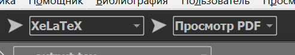

## What is inside
- Usage of AHPy lib to setup pairwise comparisons at criteria level, and at goal level
- Reporting in form of generated tex document with pairwise comparison matrices, resulting consistency ratios, and target weights of solutions (alternatives / strategies)

## How to use
- Just run all cells, the last cell generates the document

## Recommended tools
- VSCode
- IntelliCode extension
- Jupyter Extension
- Jupyter Notebook Renderers
- Python intellisense
- Pylance 

## Python Version
- confirmed work on version 3.10

## How to view the generated tex file
Install [TexMaker](https://www.xm1math.net/texmaker/download.html) to open file, generated in the directory at path `../output/output.tex`

In TexMaker, use XeLaTex to compile the file, and then click 'View PDF' to see the generated document.

